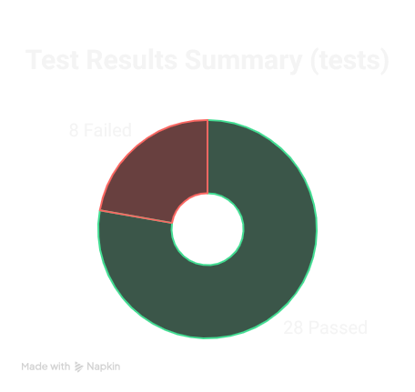

# DemoBlaze Test Automation: Test Failure Report

## Overview
This report highlights the failed tests from the automation test suite for the DemoBlaze e-commerce website. These issues should be reported to the development team for resolution.

## Testing Date
May 10, 2025

## Test Results Summary

- **Total Tests Executed**: 36
- **Passed**: 28
- **Failed**: 8
- **Skipped**: 0
- **Pass Rate**: 77.8%

## Failed Tests Summary Table

| # | Test Name | Class | Severity | Expected Behavior | Actual Behavior |
|---|-----------|-------|----------|------------------|----------------|
| 1 | testEmptyCartPurchase | ShoppingCartTests | High | Order confirmation should not appear with empty cart | System displays "Thank you for your purchase!" despite empty cart |
| 2 | testInvalidPurchaseFormData | PurchaseWorkflowTests | High | Order shouldn't complete with invalid data | System displays "Thank you for your purchase!" with invalid payment information |
| 3 | testPartialPurchaseFormValidation | PurchaseWorkflowTests | High | Order shouldn't complete with incomplete form | System displays "Thank you for your purchase!" with incomplete data |
| 4 | testEmptyContactFormSubmission | ContactFunctionalityTests | Medium | Empty contact form submission should be rejected | System accepts empty form and shows "Thanks for the message!!" |
| 5 | testEmptyMessageField | ContactFunctionalityTests | Medium | Form validation should prevent submission with empty message | System accepts the form with empty message field |
| 6 | testInvalidEmailContactForm | ContactFunctionalityTests | Medium | Form should validate email format and prevent submission | System accepts invalid email format and shows success message |
| 7 | testPurchaseDateIsCorrect | PurchaseWorkflowTests | Medium | Order date should match current date (May 10, 2025) | Order displays date as April 10, 2025 (wrong month) |
| 8 | testAboutUsModalDoesNotCloseWithEsc | ModalBehaviorTest | Low | Modal should close when ESC key is pressed | Modal remains open after ESC key press |

## Detailed Test Failures

### 1. Form Validation Issues

#### Purchase Form Validation
1. **Empty Cart Purchase (ShoppingCartTests.testEmptyCartPurchase)** 
   - **Severity**: High
   - **Description**: The system allows placing an order with an empty cart
   - **Expected**: Order confirmation should not appear with an empty cart
   - **Actual**: System displays "Thank you for your purchase!" despite the cart being empty

2. **Invalid Purchase Form Data (PurchaseWorkflowTests.testInvalidPurchaseFormData)**
   - **Severity**: High
   - **Description**: The system accepts invalid card number and date format
   - **Expected**: Order shouldn't complete with invalid data ("Invalid-Card-Number", "ABC", "XYZ")
   - **Actual**: System displays "Thank you for your purchase!" despite invalid payment information

3. **Partial Purchase Form Validation (PurchaseWorkflowTests.testPartialPurchaseFormValidation)**
   - **Severity**: High
   - **Description**: The system accepts incomplete purchase form
   - **Expected**: Order shouldn't complete with incomplete form (only name and card number provided)
   - **Actual**: System displays "Thank you for your purchase!" with incomplete data

#### Contact Form Validation
4. **Empty Contact Form Submission (ContactFunctionalityTests.testEmptyContactFormSubmission)**
   - **Severity**: Medium
   - **Description**: The contact form can be submitted without any data
   - **Expected**: Empty contact form submission should be rejected
   - **Actual**: System accepts empty form and shows "Thanks for the message!!"

5. **Empty Message Field (ContactFunctionalityTests.testEmptyMessageField)**
   - **Severity**: Medium
   - **Description**: The contact form can be submitted with empty message field
   - **Expected**: Form validation should prevent submission with empty message
   - **Actual**: System accepts the form with empty message field

6. **Invalid Email in Contact Form (ContactFunctionalityTests.testInvalidEmailContactForm)**
   - **Severity**: Medium
   - **Description**: The contact form accepts invalid email format "invalid-email"
   - **Expected**: Form should validate email format and prevent submission
   - **Actual**: System accepts invalid email format and shows success message

### 2. Date Inconsistency

7. **Purchase Date Is Incorrect (PurchaseWorkflowTests.testPurchaseDateIsCorrect)**
   - **Severity**: Medium
   - **Description**: Order confirmation shows incorrect date
   - **Expected**: Order date should match current date (May 10, 2025)
   - **Actual**: Order displays date as April 10, 2025 (wrong month)

### 3. UI/UX Issues

8. **Modal ESC Key Behavior (ModalBehaviorTest.testAboutUsModalDoesNotCloseWithEsc)**
   - **Severity**: Low
   - **Description**: About Us modal doesn't close with ESC key
   - **Expected**: Modal should close when ESC key is pressed (standard UI/UX practice)
   - **Actual**: Modal remains open after ESC key press

## Conclusion

The test results reveal several critical validation issues in the application's form processing:

1. The purchase workflow has multiple validation issues that could lead to:
   - Processing orders with invalid payment information
   - Creating orders with empty carts
   - Accepting incomplete customer information

2. The contact form validation is inadequate, allowing:
   - Empty form submissions
   - Invalid email formats
   - Empty message content

3. Date inconsistencies in order confirmations could cause confusion for users and potential accounting issues.

These findings should be prioritized for the development team to address, with particular focus on the purchase workflow validation issues which may have the highest business impact.